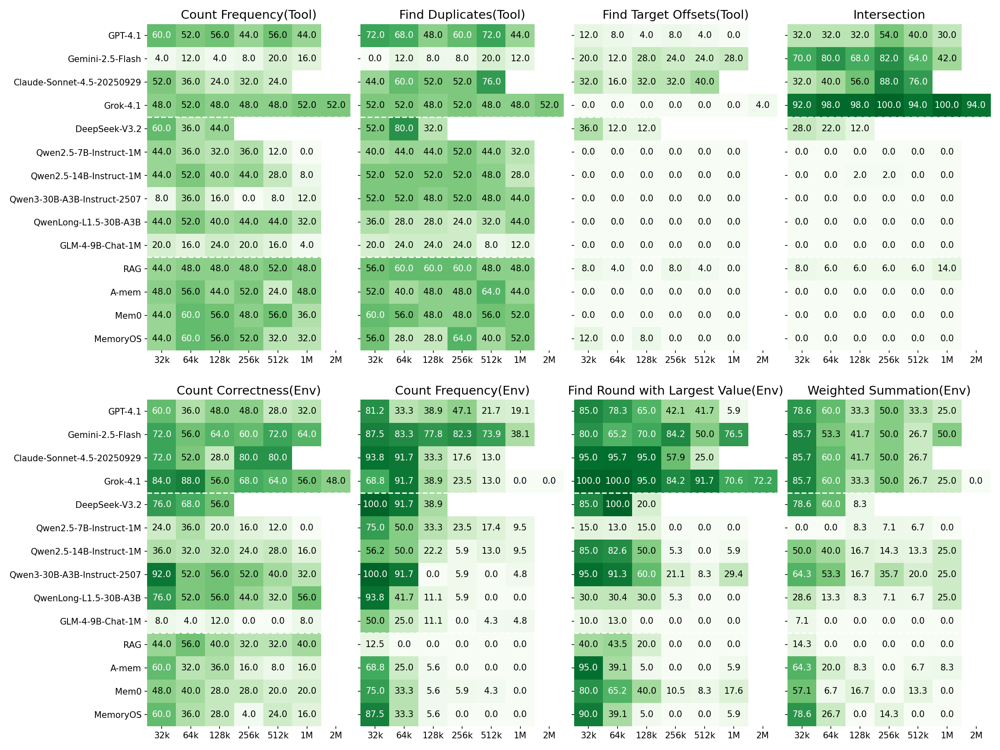

<div align="center">

# AgentLongBench: A Controllable Benchmark for Long-Context Agents

### 📄 [**Read Paper**](https://arxiv.org/abs/2601.20730) ｜ 🤗 [**HuggingFace Dataset**](https://huggingface.co/datasets/ignis/AgentLongBench) ｜ 🌐 [**Project Page**](https://github.com/euReKa025/AgentLongBench)

</div>

<br>

> **AgentLongBench** is the first benchmark designed to evaluate **Long-Context Agents** through simulated environment rollouts. Unlike traditional retrieval benchmarks, it assesses an agent's ability to perform **dynamic information synthesis**, **state tracking**, and **non-linear reasoning** across contexts ranging from **32K to 4M tokens**.

---

## 🚀 Key Features

- **Dynamic Interaction**: Evaluates agents via "Environment Rollouts" based on Lateral Thinking Puzzles, moving beyond static document QA.
- **Extreme Context Length**: Supports scalable context evaluation from **32K** up to **4M tokens**.
- **Controllable Difficulty**:
    - **Knowledge-Intensive (KI)**: Uses real-world entities (Pokémon) to test parametric memory.
    - **Knowledge-Free (KF)**: Uses symbolic masking to strictly test in-context reasoning.
- **Information Density Tests**:
    - **Concise-Response**: Hundreds of interaction rounds, testing memory fragmentation.
    - **Verbose-Response**: High-density tool logs, testing needle-in-noise retrieval.

---

## 🏆 Main Results

Below is the performance heatmap for the **Knowledge-Intensive & Concise-Response** setting. For full results, please refer to our [Paper](./agentlongbench.pdf).

<p align="center">
  
</p>

---

## 📂 Dataset & Labels

### 1. Standard Labels
We use standardized abbreviations in file paths and logs to distinguish settings.

| Dimension | Label | Full Name | Description |
| :--- | :--- | :--- | :--- |
| **Knowledge** | `ki` | Knowledge Intensive | Relies on external knowledge (e.g., Pokémon names). |
| | `kf` | Knowledge Free | Abstract entities (e.g., `Item_84`) to isolate reasoning. |
| **History** | `c` | Concise-Response | Filtered tool outputs; creates long interaction chains. |
| | `v` | Verbose-Response | Raw/Noisy tool outputs; tests info filtering. |

### 2. Task Taxonomy
[cite_start]Tasks are categorized by the information source required to answer[cite: 176].

| Category | Tasks | Description |
| :--- | :--- | :--- |
| **🛠️ Tool Response** | `Count Frequency`, `Find Duplicates`, `Find Target Offsets` | Requires parsing precise details from machine-generated logs. |
| **🌍 Env Response** | `Count Correctness`, `Count Frequency`, `Find Round with Largest Value`, `Weighted Summation` | Requires tracking state changes and feedback constraints. |
| **🧠 Final Guess** | `Intersection` | The ultimate test of global understanding and logical deduction. |

### 3. Data Layout
The dataset structure is organized by **Setting** $\rightarrow$ **Length** $\rightarrow$ **Category**.

```text
benchmark/
  ├── ki-c/                  # Knowledge Intensive + Concise
  ├── ki-v/                  # Knowledge Intensive + Verbose
  ├── kf-c/                  # Knowledge Free + Concise
  └── kf-v/                  # Knowledge Free + Verbose
       └── <length>/         # e.g., 128k, 1M, 4M
            ├── tool_response/
            │    └── <question_type>.jsonl
            ├── env_response/
            │    └── <question_type>.jsonl
            └── final_guess/
                 └── intersection.jsonl
```


### 📥 Download

The dataset is not included in the repo due to size. Please download it from Hugging Face and place it under `agentlong_bench/benchmark/`:

```bash
# Example structure after download
agentlong_bench/benchmark/ki-c/...

```

---

## ⚡ Quick Start

### Prerequisites

* Python 3.8+
* vLLM (for offline inference)

### Running Evaluation

From the `AgentLongBench` repository root, run a single-file eval (online
API runner) using the provided helper script:

```bash
bash scripts/eval_one.sh
```

Run a single-file offline vLLM evaluation:

```bash
bash scripts/run_vllm_one.sh
```

## 📝 Citation
If you find this work useful, please cite our paper:

```bibtex
@misc{fang2026agentlongbenchcontrollablelongbenchmark,
      title={AgentLongBench: A Controllable Long Benchmark For Long-Contexts Agents via Environment Rollouts}, 
      author={Shicheng Fang and Yuxin Wang and XiaoRan Liu and Jiahao Lu and Chuanyuan Tan and Xinchi Chen and Yining Zheng. Xuanjing Huang and Xipeng Qiu},
      year={2026},
      eprint={2601.20730},
      archivePrefix={arXiv},
      primaryClass={cs.CL},
      url={https://arxiv.org/abs/2601.20730}, 
}
```


